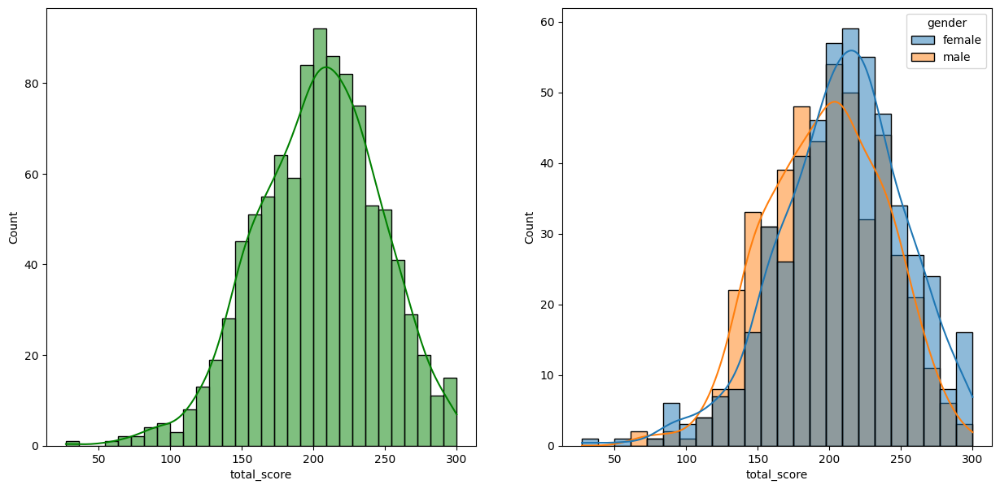
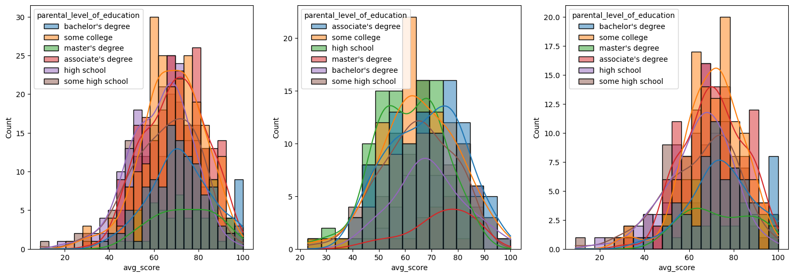
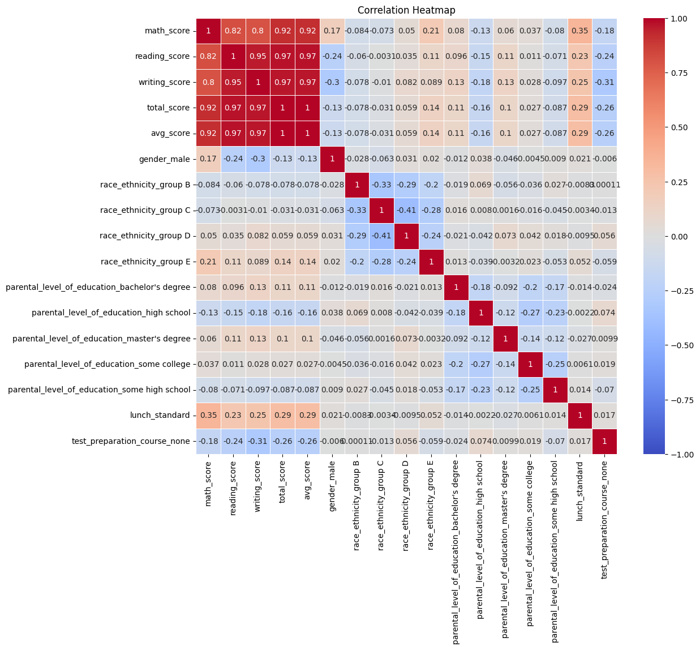
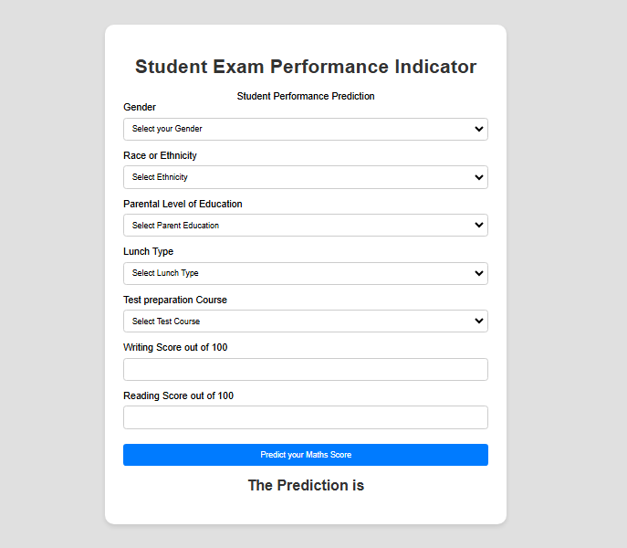
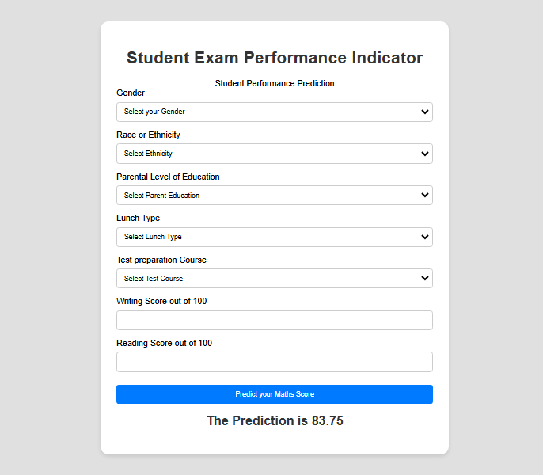

# Student Performance Prediction
## EndToEnd MLProject

## Overview
This project is an end-to-end machine learning application built using Flask, which predicts students' math scores based on various features such as gender, parental education, and more. The dataset used for this project has been cleaned, analyzed, and visualized through various data science techniques, followed by the training and evaluation of multiple machine learning models.

## Project Features
- Web application built with Flask for user interaction.
- Data preprocessing and feature engineering using one-hot encoding and standard scaling.
- Comprehensive Exploratory Data Analysis (EDA) and feature visualization.
- Model training with algorithms like **Linear Regression, Ridge, Lasso, SVM, Decision Tree, XGBoost, CatBoost, Random Forest, and AdaBoost.**
- User-friendly web interface for predicting math scores based on input features.

## Technologies Used
- **Programming Language:** Python
- **Framework:** Flask
- **Libraries:** Pandas, NumPy, Scikit-learn, XGBoost, CatBoost, Matplotlib, Seaborn
- **Web Development:** HTML, CSS
- **Version Control:** Git

## Dataset
[Dataset Link is Here....!](https://github.com/Yogesh3454/student_performance_prediction/blob/main/notebook/student.csv)

## EDA Insights
### Below are some visualizations from the Exploratory Data Analysis phase:

**1) Distribution of Scores by Gender:**


**2) Relationship between Parental Education and Scores:**


**3) Correlation Heatmap:**


## Screenshots
- **Before Prediction**


- **After Prediction**


## How to Run the Project
### Follow these steps to run the project on your local machine:

#### Clone the Repository:

```bash
git clone https://github.com/Yogesh3454/student_performance_prediction.git
```

#### Create a Virtual Environment:

```bash
conda create -p venv python==3.8 -y
```

#### Activate the Virtual Environment:

```bash
conda activate venv
```

#### Install the Dependencies:

```bash
pip install -r requirements.txt
```

#### Run the Flask Application:

```bash
python app.py
```
Access the Web App: Open your web browser and go to http://127.0.0.1:5000.

#### Git Commands
```bash
git add .
```

```bash
git commit -m "Your commit message here"
```

```bash
git push origin main
```

```bash
git pull origin main
```

```bash
git status
```

### DVC cmd

1. dvc init
2. dvc repro
3. dvc dag


## Project Workflow
- **Data Collection:** Loaded and explored the student dataset.
- **Data Cleaning and Preprocessing:** Handled missing values, encoded categorical features, and scaled numerical data.
- **Model Training:** Implemented various regression models and ensemble techniques.
- **Model Evaluation:** Used metrics like R-squared and Mean Squared Error to evaluate model performance.
- **Deployment:** Integrated the best model into the Flask web app.

## Special Thanks
A big shoutout to **Krish Naik Sir** for his invaluable guidance and resources.
